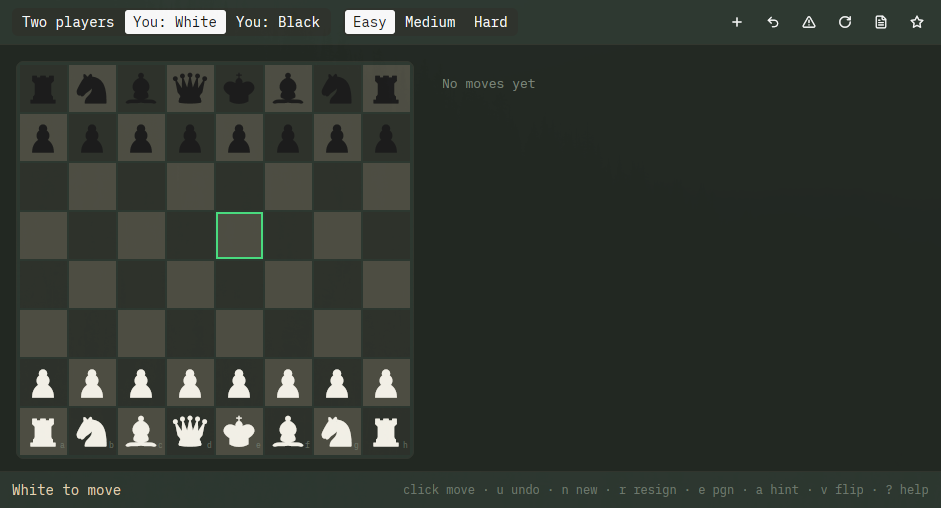

# Pichess

Chess for the [pi suite](https://github.com/raythurman2386), built with
[GPUI Kit](https://github.com/longbridge/gpui-kit) — a small, native,
theme-following desktop chess game written for Raspberry Pi 5-class
hardware (and happy on any Linux desktop).



## Features

- **Play** hotseat two-player, or against the computer as White or Black.
  Switching seats turns the board to face you automatically.
- **Three engine levels** — Easy (depth 1 with a random tie-break),
  Medium (depth ≤ 3 / 0.5 s), Hard (depth ≤ 5 / 1.5 s). Changing level
  mid-think applies immediately.
- **Full rules**: legal-move highlights, castling, en passant, promotion
  picker, and endings — checkmate, stalemate, fifty-move rule, threefold
  repetition, insufficient material.
- **Game tools**: SAN move list, undo (takes back the engine's reply in
  engine games), resign, autosave + resume, PGN export.
- **Aesthetic**: keyboard-first, segmented top bar, board that re-fits the
  window, a short pause before the engine replies, and live desktop
  theming (pimarchy/Omarchy palette + text scale).
- **Sounds**: a wood knock when a piece lands, a heavier knock for a
  capture, a soft bell on check, and quiet clicks for buttons.
  `PICHESS_DISABLE_SOUND=1` turns them off.

## The engine

Written from scratch in pure Rust on a 0x88 mailbox board — no chess
libraries:

- Iterative-deepening negamax alpha-beta with quiescence search
- MVV-LVA, killer-move, and history-heuristic move ordering
- Incremental Zobrist hashing with exact make/undo restoration
- Material + piece-square-table evaluation with light pawn/bishop terms

Correctness is pinned by 75 tests, including published perft counts for
the start position (depths 1–5), Kiwipete, and the Chess Programming Wiki
perft positions, plus make/undo roundtrip checks over full Zobrist
restoration. Run the harness headless: `pichess --perft 5` (≈16M nodes/s
release on x86_64).

## Install

User-local install from a tagged release (no root, Ed25519-verified,
fail-closed):

```sh
curl -fsSL https://raw.githubusercontent.com/raythurman2386/pichess/main/scripts/netinstall.sh | bash
```

Or build and install from source:

```sh
cargo build --release
./scripts/install.sh
```

Uninstall with `./scripts/uninstall.sh`.

## Keyboard

| Keys | Action |
|---|---|
| Click / `space` / `enter` | Pick up & drop a piece |
| Arrows / `hjkl` | Move the cursor |
| `u` / `n` / `r` | Undo · new game · resign |
| `e` | Export PGN to `~/.local/share/pichess/exports/` |
| `a` | Engine plays the current move (hint) |
| `v` | Flip board · `1`/`2`/`3` difficulty |
| `?` | Help overlay · `F11`/`Super+F` fullscreen · `Ctrl+Q` quit |

## State and theming

- Game autosave and per-level records live in `~/.local/share/pichess/`;
  writes are atomic and a corrupt file resets instead of panicking.
- Colors follow the desktop theme — `~/.local/state/pimarchy/current/theme/colors.toml`
  first, then Omarchy — re-tinting live on theme switches; text follows
  the desktop text scale. `PICHESS_THEME_DIR` overrides the search for
  tests.

## Pieces attribution

The chess piece SVGs in `assets/icons/` are the
[Cburnett set](https://commons.wikimedia.org/wiki/Category:SVG_chess_pieces)
from Wikimedia Commons, licensed
[CC BY-SA 3.0](https://creativecommons.org/licenses/by-sa/3.0/). This
app's code is MIT; the piece artwork remains under its own license.

## Sounds

Move and button sounds in `assets/sounds/` are from
[Kenney](https://kenney.nl) (Interface Sounds and Impact Sounds),
[CC0](https://creativecommons.org/publicdomain/zero/1.0/). See
`assets/sounds/CREDITS.txt` for which file became which cue.

## Development

```sh
cargo fmt --check          # formatting
cargo clippy --all-targets -- -D warnings
cargo test                 # 75 tests incl. perft suites
cargo run --release        # play
```

CI runs fmt, clippy, tests, a `--version` smoke test, and the netinstall
integrity harness on every push; tagged `v*` releases build x86_64 +
aarch64 tarballs (glibc 2.39+, e.g. Raspberry Pi OS / Debian 13).

## License

MIT — see [LICENSE](LICENSE). Chess piece artwork: CC BY-SA 3.0.
Sounds: CC0 (Kenney). See above.